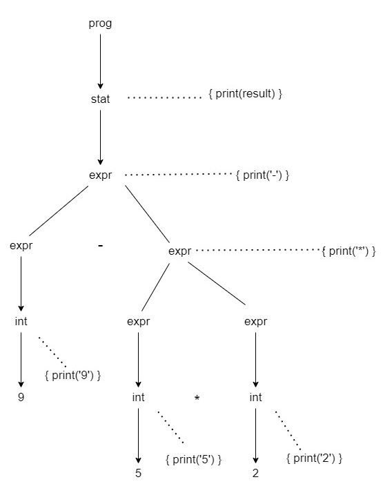
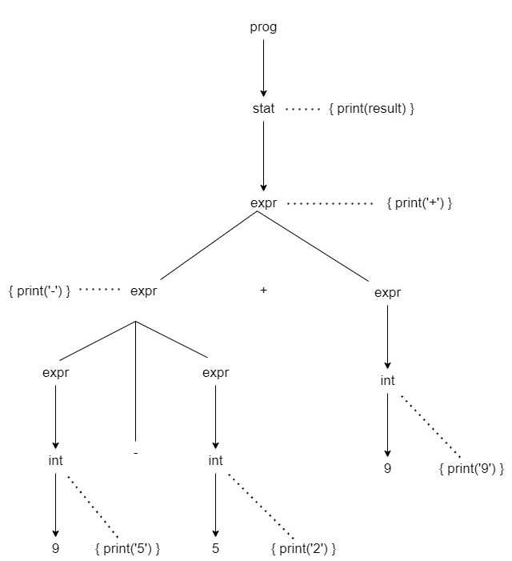

## Aufgabe 1

### 1. Syntax driven Definition

```
prog.val = stat.val
stat.val = expr1.val
expr.val = int.val
expr.val = expr1.val + expr2.val
expr.val = expr1.val - expr2.val
expr.val = expr1.val * expr2.val
expr.val = expr1.val / expr2.val
expr.val = ( expr.val )

```
### 2. 
Das val attribut ist synthetisiert, da sein Wert vorhanden ist
   abgeleitet von den Werten der Attribute in den untergeordneten Elementen des entsprechenden
   nichtterminal im Analysebaum während einer Bottom-Up-Traversierung.
### 3. 
Die syntaxgesteuerte Definition ist S- attributiert, da alle Attribute synthetisiert sind.
### 4. Annotierte Baum

#### 9-5+2
```
        prog.v=6
           |
        stat.v=6
       /         \
      stat.v=6       n
     /        \
    /          \
expr.v=4  +  int.v=2
/        \           \
int.v=9 - int.v=5      2
|          |
9          5

```

#### 9-5*2

```
        prog.v=-1
         |
        stat.v=-1
       /   |   \
  expr.v=9 - expr.v=10
     /        \
  int.v=9     expr.v=10
   |          /   |   \
   9    expr.v=5  *  expr.v=2
           /             \
          /               \
        int.v=5      int.v=2
          |             |
          5             2
```

### 5. Translation Schema
```
prog -> stat            { print(stat.result) }
stat -> expr n | n      { print(expr.result) }
expr -> INT             { print(INT.result) }
expr -> expr + expr     { print('+') }
expr -> expr - expr     { print('-') }
expr -> expr * expr     { print('*') }
expr -> expr / expr     { print('/') }
expr -> ( expr )        { print(expr.result) }
```

### Parse Tree für Übersetzungschema
#### 9-5*2


#### 9-5+2



